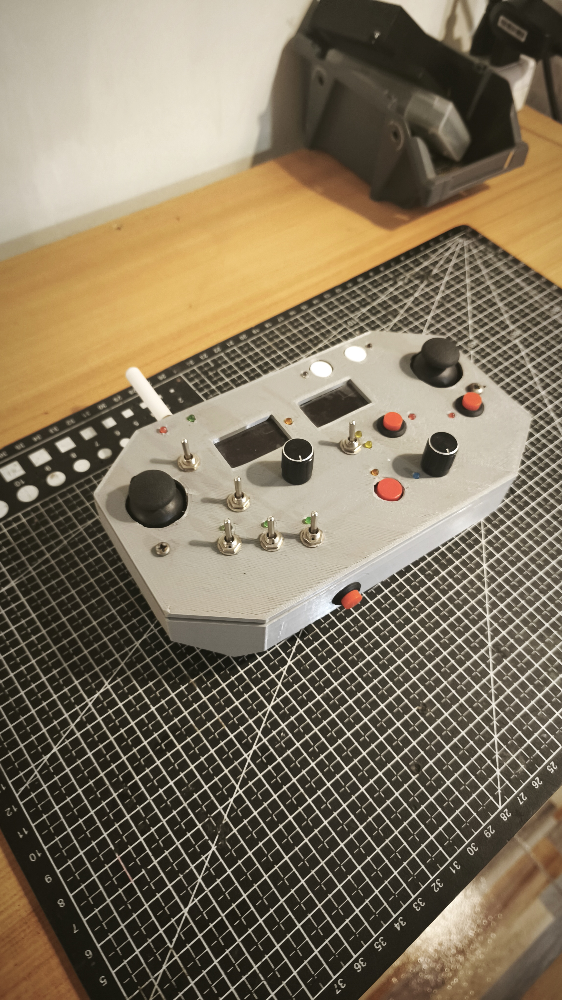
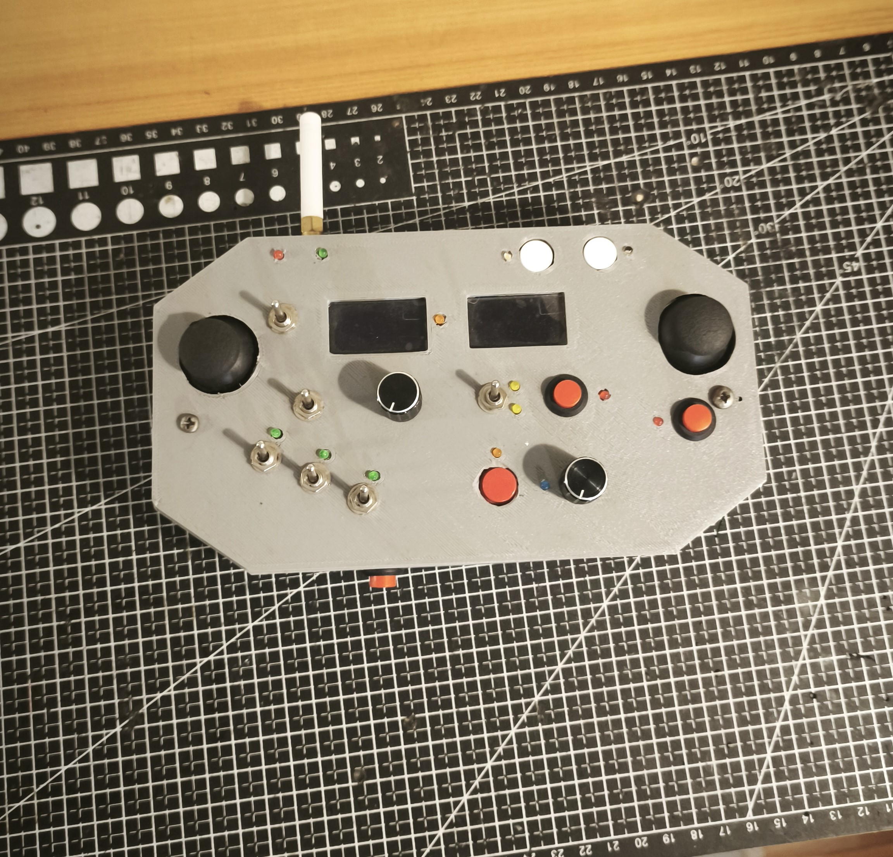

# Control-X
## Description / Descripción

- This RC controller allows for a wide range of variability and functionality when it comes to controlling robots or remotely operated devices. It is focused on controlling robots that physically interact at a distance, featuring two OLED displays for telemetry data and statistics visualization, as well as potentiometers, levers, push buttons, and joysticks, totaling 16 interactive channels and countless digitally programmable channels for data transfer.
- Este control RC permite tener una amplia variablidad y funcionamiento cuando se trata de controlar robots o dispositivos teledirigidos, esta enfocado en controlar robot que interactuen fisicamente a distancia, contando con pantallas oled (2) para visualización de datos telemétricos y estadísticas, potenciometros, palancas, pulsadores y joysticks, lo que suma un total de 16 canales interactivos e innumerables canales programables digitalmente para transferencia de datos.

## Images / Imágenes

## Components / Componentes
- ESP32
- PCA9685
- OLED displays
- Joysticks
- Switches / levers
- Potentiometers
- Push buttons
- LoRa Ebyte E220 400T-22D
- Battery pack, 9V-1000mAh
- 3mm LEDs

## Materials / Materiales
- PLA

## Operation / Funcionamiento
- The controller processes digital/analog input signals and compresses them into a single data packet, which is later decompressed to use the data in a universal and fully customizable way. It can also send and receive data through previously programmed digital channels.
- It has a range of up to 10 kilometers under ideal conditions.
- El controlador procesa las señales de entrada digitales/analógicas y las comprime en un único paquete de datos que luego se descomprime para poder utilizar esos datos de forma universal y completamente personalizada. Además se pueden recibir y enviar datos mediante canales digitales previamente programados.
- Tiene un alcanze de hasta 10 kilometros en condiciones ideales.
## Results / Resultados
- It enables a fast interface to control robots and visualize data easily and quickly.
- Permite una rápida interfaz para poder controlar robots y visualizar datos de forma fácil y rápida.
